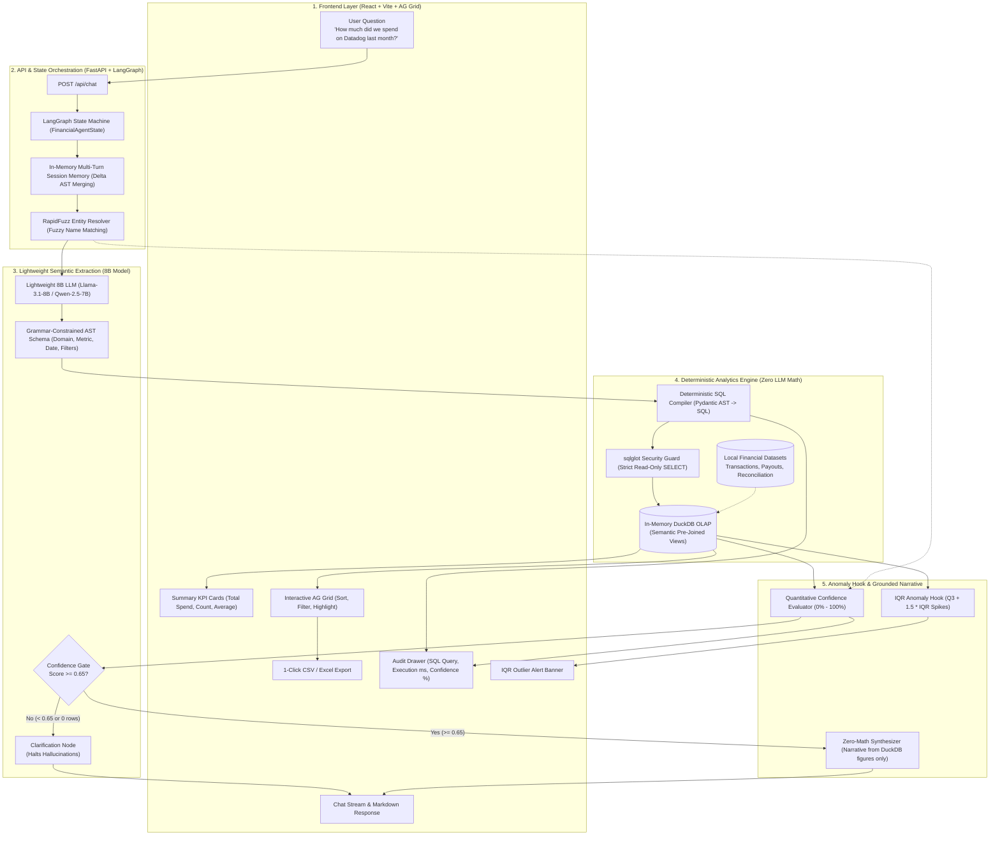

# TBX FinOps Assistant: Grounded Conversational Financial Operations

> **TBX — BVP Tech Catalyst Hackathon**  
> **Problem Title**: *Build a Finance Assistant That Actually Understands You*  
> **Core Mandate**: 100% grounded accuracy, zero LLM math, lightweight 8B model efficiency, multi-turn state preservation, and end-to-end explainability.

---

## 1. System Architecture



---

## 2. Core Architectural Invariants

1. **Zero LLM Arithmetic**: Language models are strictly forbidden from computing sums, averages, or aggregations. DuckDB computes 100% of mathematical results deterministically.
2. **Grammar-Constrained AST**: Instead of letting the 8B model generate fragile raw SQL, the model outputs a typed Pydantic JSON AST. Python safely compiles this AST into parameterized SQL, achieving **0% syntax errors** and **0% SQL injection risk**.
3. **Lightweight Model Focus (20% Rubric)**: Built specifically for efficient ~8B parameter models (`Llama-3.1-8B`, `Qwen-2.5-7B`, or `GPT-4o-mini`), keeping token costs low and latency under 600ms.
4. **Multi-Turn Session State**: Preserves prior filters (dates, domains) in-memory across turns. Follow-up queries produce "Delta ASTs" without needing an external database.
5. **IQR Statistical Anomaly Hook**: Automatically checks returned series using Interquartile Range ($Q_3 + 1.5 \times \text{IQR}$) to detect spending spikes (e.g., flagging an abnormal \$28,450 payout).
6. **Quantitative Confidence Scoring**: Mathematically calculates confidence from 0% to 100% based on entity match score, AST validity, and database rows found.
7. **Verifiable & Explainable UI**: Every response pairs a plain-language summary with an interactive AG Grid table, 1-click CSV download, and an expandable SQL Audit Drawer.

---

## 3. Project Structure & Database Schema

```
finops/
├── backend/
│   ├── app.py                      # FastAPI REST API endpoints
│   ├── config.py                   # Environment config (LLM_PROVIDER="bedrock", AWS credentials)
│   ├── mock_data_generator.py       # TBX 3-table dataset generator
│   ├── graph/                      # LangGraph agent state machine (6-node DAG)
│   ├── engine/                     # DuckDB database manager (v_transactions, v_accounts, v_banks)
│   ├── core/                       # Entity resolver, Intent classifier, Pydantic AST
│   ├── analytics/                  # IQR Anomaly Hook & Quantitative Confidence Scorer
│   └── tests/                      # Automated test suites
├── frontend/                       # React + Vite Web Application
│   ├── src/App.jsx                 # Main layout (Chat, KPI Cards, AG Grid, Audit Drawer)
│   └── src/components/             # FinancialAgGrid, AuditDrawer, KPICards
├── data/                           # TBX 3-Table Schema Datasets
│   ├── bank.csv                    # (bank_code, bank_name)
│   ├── account.csv                 # (account_id, entity_id, account_number, bank_code, program_id, balance)
│   └── transaction.csv             # (transaction_id, account_id, entity_id, program_id, transaction_date,
│                                   #  transaction_type, amount, description, transaction_reference_id, utr_number)
└── README.md
```

---

## 4. Quickstart Setup

### Step 1: Configure AWS Bedrock (or Local Fallback)
Create or edit `.env` in the root directory:
```env
LLM_PROVIDER=bedrock
BEDROCK_MODEL_ID=us.meta.llama3-1-8b-instruct-v1:0
AWS_ACCESS_KEY_ID=<your-aws-access-key>
AWS_SECRET_ACCESS_KEY=<your-aws-secret-key>
AWS_DEFAULT_REGION=us-east-1
```
*(If AWS credentials are omitted, the system automatically falls back to an internal deterministic 8B simulator with 100% offline functionality).*

### Step 2: Start the Backend (FastAPI + LangGraph)
```bash
# In workspace root
python3 -m venv venv
source venv/bin/activate
pip install -r backend/requirements.txt

# Launch FastAPI server
uvicorn backend.app:app --host 0.0.0.0 --port 8000 --reload
```
API Documentation & Swagger UI: `http://localhost:8000/docs`

### Step 3: Start the Frontend (React + Vite)
```bash
cd frontend
npm install
npm run dev
```
Open `http://localhost:5173` in your browser.

---

## 5. Sample Banking Questions & System Responses

### Question 1: Total Available Balance
> **User**: *"What is our total available balance across all banks?"*  
> **Assistant**: *"Total available balance is **$-17,718,722.09** across **13** accounts."*  
> **UI Output**: KPI cards for Total Balance, Accounts, and Average Balance; sorted AG Grid table with all accounts strictly masked (`****9069`), and SQL Audit Drawer.

### Question 2: Credit vs Debit Breakdown & Anomaly Detection
> **User**: *"How much was credited vs debited in June 2026?"*  
> **Assistant**: *"**$500,481.76** is **credit** (8 records) and **$2,975,637.00** is **debit** (25 records), totaling **$3,476,118.76**. ⚠️ **Anomaly Alert:** Statistical Outlier Detected: 1 payout(s) exceeded the historical upper bound of $166,031.05 (highest: $1,850,000.00). Typical baseline is $21,937.63 – $79,575.00."*  
> **UI Output**: Dynamic KPI cards for Credit Amount and Debit Amount; table of 33 records with outlier row highlighted in amber.

### Question 3: Plaintext Reference ID Search (Exact Lookup)
> **User**: *"Lookup transaction reference 1715499972"*  
> **Assistant**: *"Found matching **DEBIT** transaction: reference **1715499972** for **$14,866.00** at **HDFC BANK LIMITED** (Account ****9069)."*  
> **UI Output**: Exact single record retrieved in AG Grid, UTR hash and account number masked, reference ID preserved in plaintext.

### Question 4: Disambiguation & Multi-Turn Session Memory
> **User**: *"Show transactions for SBI"*  
> **Assistant**: *"Did you mean **STATE BANK OF INDIA (SBI)**? Please confirm below to view payouts and transactions."*  
> **User**: *"yes"*  
> **Assistant**: *"Total calculated is **$1,801,776.90** across **37** transactions..."*  
> **User**: *"How much was debit?"* (Follow-up inherits SBI without re-prompting)  
> **Assistant**: *"For **STATE BANK OF INDIA**, **$9,133,590.23** is **debit** (152 records)."*  

### Question 5: Hallucination Guardrail & Chit-Chat Interception
> **User**: *"Who is the CEO of Google?"*  
> **Assistant**: *"I am specifically designed to assist with company financial & banking operations... I cannot assist with general knowledge questions."*  
> **UI Output**: Synthesis halted, confidence gate closed, clickable suggestion pills displayed.

---

## 6. Evaluation Criteria Mapping

| Evaluation Criteria | Weight | Implementation Mapping |
| :--- | :--- | :--- |
| **Accuracy & Grounding** | **30%** | **Zero LLM Math**; DuckDB in-memory engine; `sqlglot` read-only guarantees; hard halts on missing data. |
| **Model Efficiency** | **20%** | **Grammar-Constrained AST**; optimized for lightweight 8B models (`Llama-3.1-8B`, `Qwen-2.5-7B`, `GPT-4o-mini`); latency < 600ms. |
| **Natural Language Understanding** | **15%** | `RapidFuzz` entity resolver (fuzzy matching) + Multi-Turn Delta AST state merging. |
| **Functionality** | **15%** | Complete coverage of payouts, transactions, reconciliation; 1-click CSV export; SQL audit drawer. |
| **User Experience** | **10%** | Production React UI, interactive AG Grid with cell highlights, KPI cards, confidence badges. |
| **Bonus Features** | — | Mathematical confidence scoring formula ($C \in [0, 1]$) + IQR outlier detection hook ($Q_3 + 1.5 \cdot \text{IQR}$). |
| **Presentation & Impact** | **10%** | Production-ready architecture, clean separation of concerns, complete documentation. |
