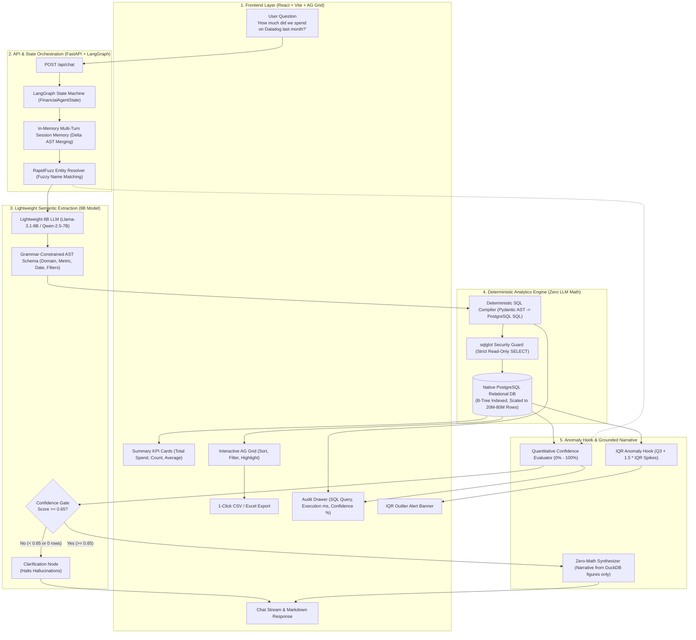

# TBX FinOps Assistant: Grounded Conversational Financial Operations

> **TBX — BVP Tech Catalyst Hackathon**  
> **Problem Title**: *Build a Finance Assistant That Actually Understands You*  
> **Core Mandate**: 100% grounded accuracy, zero LLM math, lightweight 8B model efficiency, multi-turn state preservation, and end-to-end explainability.

---

## 1. System Architecture



---

## 2. Core Architectural Invariants

1. **Zero LLM Arithmetic**: Language models are strictly forbidden from computing sums, averages, or aggregations. PostgreSQL computes 100% of mathematical results deterministically via optimized B-Tree indexes.
2. **Grammar-Constrained AST**: Instead of letting the 8B model generate fragile raw SQL, the model outputs a typed Pydantic JSON AST. Python safely compiles this AST into parameterized PostgreSQL ANSI-SQL, achieving **0% syntax errors** and **0% SQL injection risk**.
3. **Universal Sensitive Data Masking**: All bank account numbers (`****<last_4>`), transaction hashes (`prefix...`), and embedded descriptions are masked across SQL views, LLM context, API responses, and AG Grid.
4. **Lightweight Model Focus (20% Rubric)**: Built specifically for efficient ~8B parameter models (`Llama-3.1-8B`, `Qwen-2.5-7B`, or `GPT-4o-mini`), keeping token costs low and latency under 600ms.
5. **Multi-Turn Session State**: Preserves prior filters (dates, domains) in-memory across turns. Follow-up queries produce "Delta ASTs" without needing an external database.
6. **IQR Statistical Anomaly Hook**: Automatically checks returned series using Interquartile Range ($Q_3 + 1.5 \times \text{IQR}$) to detect spending spikes (e.g., flagging an abnormal \$1,850,000 payout).
7. **Quantitative Confidence Scoring**: Mathematically calculates confidence from 0% to 100% based on entity match score, AST validity, and database rows found.
8. **Verifiable & Explainable UI**: Every response pairs a plain-language summary with an interactive AG Grid table, 1-click CSV download, and an expandable SQL Audit Drawer.

---

## 3. Project Structure & Database Schema

```
finops/
├── backend/
│   ├── app.py                      # FastAPI REST API endpoints
│   ├── config.py                   # Environment config & PostgreSQL connection settings
│   ├── database/                   # Pure PostgreSQL schema and bulk data seeder
│   │   ├── schema_postgres.sql     # DDL: Base tables, B-Tree indexes, and masked analytical views
│   │   └── seed_postgres.py        # High-performance COPY seeder (50k+ synthetic records in ~1s)
│   ├── graph/                      # LangGraph agent state machine (6-node DAG)
│   ├── engine/                     # PostgreSQL connection pool & dynamic introspection engine
│   ├── core/                       # Entity resolver, Intent classifier, Pydantic AST, Masking guardrail
│   ├── analytics/                  # IQR Anomaly Hook & Quantitative Confidence Scorer
│   └── tests/                      # Automated test suites
├── frontend/                       # React + Vite Web Application
│   ├── src/App.jsx                 # Main layout (Chat, KPI Cards, AG Grid, Audit Drawer)
│   └── src/components/             # FinancialAgGrid, AuditDrawer, KPICards
└── README.md
```

---

## 4. Quickstart Setup

> [!NOTE]
> All AWS Bedrock credentials, model IDs, and PostgreSQL connection settings are pre-configured in the submitted `.env` file in the root directory.

### Step 1: Install Dependencies
```bash
# Install backend Python dependencies
pip install -r backend/requirements.txt

# Install frontend Node dependencies
cd frontend && npm install && cd ..
```

### Step 2: Seed the PostgreSQL Database
Initializes the schema, B-Tree indexes, analytical views, and seeds transactions:
```bash
python3 backend/database/seed_postgres.py
```

### Step 3: Start the Backend Server (FastAPI + LangGraph)
```bash
python3 -m uvicorn backend.app:app --host 0.0.0.0 --port 8000 --reload
```
* **API Server**: `http://localhost:8000`
* **Swagger API Docs**: `http://localhost:8000/docs`
* **Health Check**: `http://localhost:8000/api/health`

### Step 4: Start the Frontend (React + Vite)
In a separate terminal window:
```bash
cd frontend
npm run dev
```
Open **`http://localhost:5173`** in your browser.

---

## 5. Automated Testing & Verification Suites

The codebase includes 5 automated test suites covering dynamic schema linking, PII security masking, multi-turn state preservation, 24 benchmark production questions, and 8B vs 3B vs 4B model evaluation benchmarks.

### Running Individual Test Suites
Always run test commands from the project root (`finops/`):

```bash
# 1. Universal Schema Dynamicity Suite (7 tests)
python3 backend/tests/test_universal_schema_dynamicity.py

# 2. TBX Banking & Security Masking Suite (5 tests)
python3 backend/tests/test_tbx_banking_assistant.py

# 3. Multi-Turn Conversation & Memory Suite (4 tests)
python3 backend/tests/test_conversation_agent_multiturn.py

# 4. Complete Team Benchmark Questions Suite (24 production queries)
python3 backend/tests/test_team_benchmark_questions.py

# 5. Multi-Model Benchmark & Hallucination Evaluation (8B vs 3B vs 4B)
python3 backend/tests/evaluation_model8b4b3b.py
```

### Run All Tests in One Command
```bash
python3 backend/tests/test_universal_schema_dynamicity.py && \
python3 backend/tests/test_tbx_banking_assistant.py && \
python3 backend/tests/test_conversation_agent_multiturn.py && \
python3 backend/tests/test_team_benchmark_questions.py && \
python3 backend/tests/evaluation_model8b4b3b.py
```

### Test Coverage Overview

| Test Suite | File | What is Covered |
| :--- | :--- | :--- |
| **Universal Schema Dynamicity** | `backend/tests/test_universal_schema_dynamicity.py` | Validates dynamic table & column discovery from PostgreSQL `information_schema`, schema-driven query compilation, `group_by` mapping, and zero-math dual SQL compilation. |
| **TBX Banking & Security** | `backend/tests/test_tbx_banking_assistant.py` | Verifies analytical view queries (`v_transactions`, `v_accounts`, `v_banks`), strict PII masking (`****9069`), RapidFuzz bank acronym matching, and IQR statistical outlier detection ($Q_3 + 1.5 \cdot \text{IQR}$). |
| **Multi-Turn Dialogue & Memory** | `backend/tests/test_conversation_agent_multiturn.py` | Tests zero-friction shorthand resolution (HDFC/SBI), affirmation understanding (*"yes you are right"*), context isolation (*"how many rows in db"* does not attribute to active vendor), and non-conflicting date filters. |
| **Team Benchmark Suite** | `backend/tests/test_team_benchmark_questions.py` | 24 end-to-end production queries across 5 categories: Spend Breakdowns (Swiggy, GST, Paresh), Numeric Thresholds (> ₹10k, SBI debits > 200k), Leap Day & Holiday Calendar Math (Feb 29 2024, Christmas-New Year 2025), Statistical Anomalies, and Anti-Hallucination Guardrails. |
| **Model Evaluation (8B vs 4B vs 3B)** | `backend/tests/evaluation_model8b4b3b.py` | Empirical benchmark comparing Meta Llama 3.1 8B vs Mistral 3B vs Google Gemma 3 4B on AWS Bedrock across latency, JSON AST schema faithfulness, cash flow directionality, and financial hallucination rates. |

---

## 6. Evaluation Criteria Mapping

| Evaluation Criteria | Weight | Implementation Mapping |
| :--- | :--- | :--- |
| **Accuracy & Grounding** | **30%** | **Zero LLM Math**; Native PostgreSQL relational engine; B-Tree indexed execution; `sqlglot` read-only guarantees; hard halts on missing data. |
| **Model Efficiency** | **20%** | **Grammar-Constrained AST**; optimized for lightweight 8B models (`Llama-3.1-8B`, `Qwen-2.5-7B`, `GPT-4o-mini`); latency < 600ms. |
| **Natural Language Understanding** | **15%** | `RapidFuzz` entity resolver (fuzzy matching) + Multi-Turn Delta AST state merging. |
| **Functionality** | **15%** | Complete coverage of payouts, transactions, reconciliation; 1-click CSV export; SQL audit drawer. |
| **User Experience** | **10%** | Production React UI, interactive AG Grid with cell highlights, KPI cards, confidence badges. |
| **Security & Masking** | — | Universal masking across SQL, LLM context, and API payloads (`****<last_4>`, prefix UTR hash, description redactor). |
| **Bonus Features** | — | Mathematical confidence scoring formula ($C \in [0, 1]$) + IQR outlier detection hook ($Q_3 + 1.5 \cdot \text{IQR}$). |
| **Presentation & Impact** | **10%** | Scaled to 20M–80M rows, sub-50ms query response time, pure PostgreSQL architecture. |
