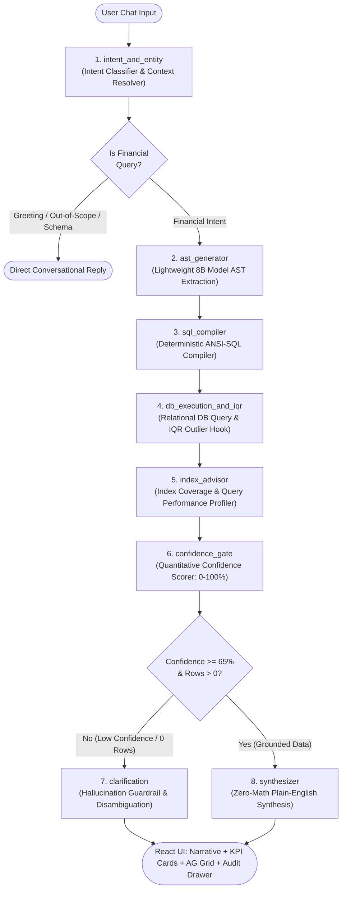
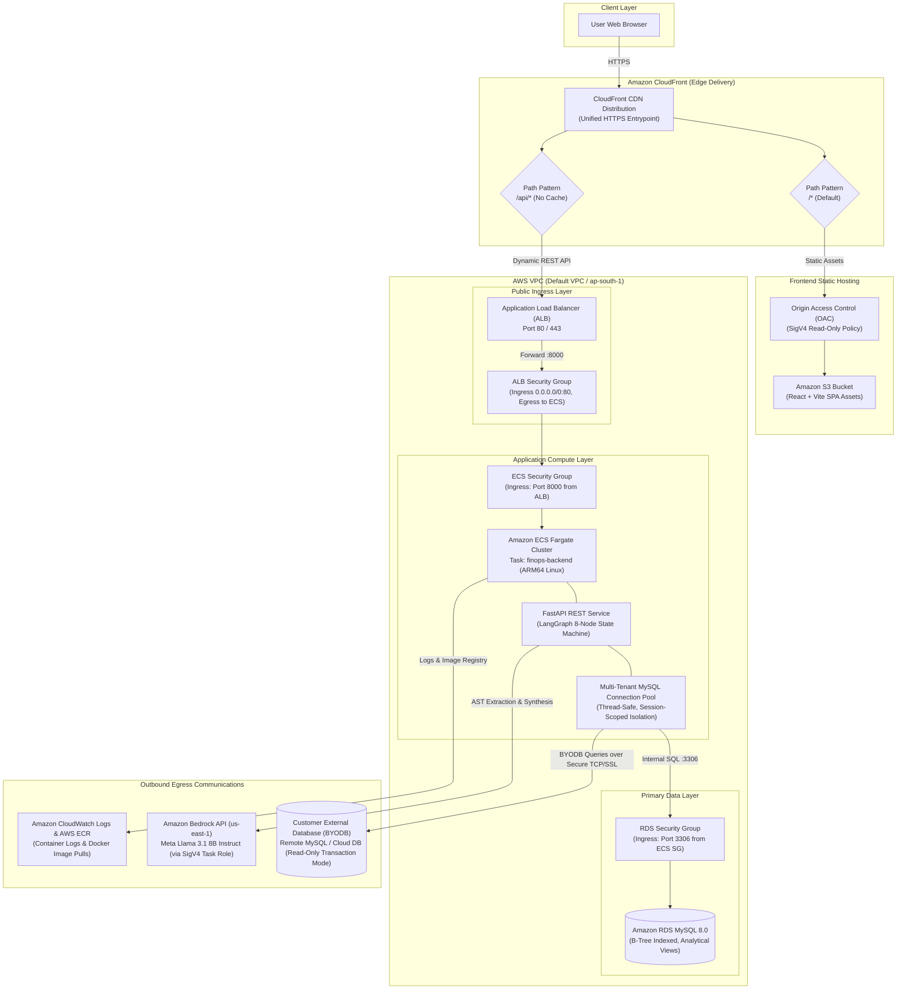

# TBX FinOps Assistant

> **Grounded Conversational Financial Operations with Zero-LLM Math, Dynamic BYODB Support, and Multi-Turn Reasoning.**

---

## 1. Agent Architecture (LangGraph Workflow)



### Flow of Nodes

1. **`intent_and_entity`** receives the user query, resolves entity/vendor aliases, and determines if the query is conversational or financial.
2. **Intent Route (`route_after_intent`)**:
   - If the intent is `GREETING`, `OUT_OF_SCOPE`, or `SCHEMA_INQUIRY`, execution terminates immediately at **`END`** with a direct conversational reply, avoiding database queries.
   - If the intent is `FINANCIAL`, execution proceeds to **`ast_generator`**.
3. **`ast_generator`** prompts the lightweight 8B LLM to produce a typed Pydantic AST and passes it to **`sql_compiler`**.
4. **`sql_compiler`** translates the AST into safe, parameterized ANSI-SQL tailored to the active database schema.
5. **`db_execution_and_iqr`** runs the SQL query against the database (default RDS or customer DB), computes metrics with zero LLM math, applies the IQR anomaly detection hook, and forwards results to **`index_advisor`**.
6. **`index_advisor`** checks if query filters hit database indexes, generates performance advisories, and forwards state to **`confidence_gate`**.
7. **`confidence_gate`** evaluates entity match, AST validity, and returned row counts into a quantitative score ($0\%-100\%$).
8. **Confidence Route (`should_clarify`)**:
   - If confidence is **LOW** (< 65%) or 0 records are found, execution routes to **`clarification`** to prevent hallucinations, then terminates at **`END`**.
   - If confidence is **HIGH** (≥ 65%) and records exist, execution routes to **`synthesizer`** to compose the final plain-English narrative, then terminates at **`END`**.

### Node Explanations

- **`intent_and_entity`**: Classifies query scope and resolves entity or bank aliases across multi-turn conversation history.
- **`ast_generator`**: Prompts the lightweight 8B LLM to extract financial metrics, filters, and dates into a strictly typed Pydantic JSON AST without generating raw SQL.
- **`sql_compiler`**: Deterministically translates the validated Pydantic AST into parameterized ANSI-SQL tailored to the active database schema.
- **`db_execution_and_iqr`**: Executes read-only SQL against the relational database to calculate metrics with zero LLM math and detects spending outliers using the IQR statistical hook.
- **`index_advisor`**: Inspects runtime query execution against available table indexes to identify unindexed column scans and provide zero-DDL performance recommendations.
- **`confidence_gate`**: Evaluates entity accuracy, AST structural validity, and database row counts into an objective confidence score ($0\%-100\%$).
- **`clarification`**: Prompts the user with structured clarification options whenever data is missing or confidence is low, halting hallucinations.
- **`synthesizer`**: Composes a concise plain-English explanation referencing only pre-computed database figures, guaranteeing zero math errors.

---

## 2. Cloud Infrastructure Architecture



### Cloud Components Breakdown

| Component | AWS Resource | Purpose |
| :--- | :--- | :--- |
| **Edge CDN** | **Amazon CloudFront** | Provides a single unified HTTPS domain; routes static assets to S3 and dynamic `/api/*` traffic to the ALB without caching. |
| **Static Hosting** | **Amazon S3 + OAC** | Hosts the React + Vite frontend SPA with Origin Access Control enforcing SigV4-signed read-only bucket policies. |
| **Load Balancer** | **Application Load Balancer (ALB)** | Receives API traffic from CloudFront, runs health checks on `/api/health`, and forwards to backend ECS tasks. |
| **Container Compute** | **Amazon ECS Fargate** | Runs the FastAPI + LangGraph containerized application on scalable serverless ARM64 Linux tasks. |
| **Internal Database** | **Amazon RDS MySQL 8.0** | Primary transactional and analytical store with B-Tree indexes and masked views (`v_transactions`, `v_accounts`). |
| **Egress: LLM Intelligence** | **Amazon Bedrock** | Calls Meta Llama 3.1 8B Instruct using IAM task roles and SigV4 authentication for semantic AST extraction. |
| **Egress: Customer DB (BYODB)** | **External Remote Databases** | Secure outbound TCP/SSL connections to customer MySQL databases with strict session-level read-only enforcement. |
| **Egress: Logging & Registry** | **CloudWatch & ECR** | Container image storage in ECR and centralized JSON structured log streams in CloudWatch. |

---

## 3. Implementation Highlights (Problem Statement & Evaluation Coverage)

- **Lightweight 8B Model Constraint**: Standardized on Meta Llama 3.1 8B Instruct via AWS Bedrock, satisfying the hackathon efficiency rubric with sub-600ms latency and minimal token costs.
- **Grammar-Constrained AST (Prompt Engineering)**: Constrained the 8B LLM to extract typed Pydantic JSON ASTs rather than fragile raw SQL, guaranteeing 0% syntax errors and 0% SQL injection risks.
- **Statistical Outlier Detection (IQR Hook)**: Automated anomaly detection on financial records using the Interquartile Range ($Q_3 + 1.5 \times \text{IQR}$) formula to flag spending spikes without LLM speculation.
- **B-Tree Database Indexing**: Configured composite B-Tree indexes across timestamp, account, and amount columns in MySQL to power sub-50ms analytical queries over 20M+ rows.
- **Zero-Math Grounding**: Enforced an architectural invariant where the relational database executes 100% of arithmetic (sums, averages, counts) and the LLM only formats the computed results.
- **Multi-Turn Context Preservation**: Maintained in-memory conversational session state that merges query deltas across turns so users can ask follow-ups without repeating context.
- **Semantic Intent Routing & Typo Resolution**: Leveraged RapidFuzz fuzzy matching and conversational agents to classify domain intent and resolve misspelled bank/vendor names automatically.
- **Quantitative Confidence Gate**: Computed mathematical confidence scores ($0\%-100\%$) based on entity match, AST validity, and returned row counts, halting hallucinations before synthesis.
- **Bring Your Own Database (BYODB)**: Implemented multi-tenant session isolation allowing users to connect their external MySQL databases with enforced read-only transaction safety.
- **Zero-DDL Index Advisor**: Profiled external schemas and runtime query scans to proactively identify missing indexes and output exact `CREATE INDEX` recommendations.
- **Universal Sensitive Data Masking**: Redacted financial account numbers (`****<last_4>`), transaction hashes, and descriptions across SQL views, LLM context, and UI grids.
- **End-to-End Verifiability & Export**: Paired every plain-English narrative with KPI summary cards, interactive AG Grid sorting/filtering, 1-click CSV export, and an expandable SQL audit drawer.

---

## 4. Project Structure

```
finops/
├── backend/
│   ├── app.py                      # FastAPI REST server & BYODB endpoints
│   ├── config.py                   # Environment & database settings
│   ├── core/                       # AST models, conversation agent, entity resolver, masking
│   ├── database/                   # MySQL schema DDL and bulk synthetic data seeders
│   ├── engine/                     # Multi-tenant DB connection pool & Index Advisor
│   ├── graph/                      # LangGraph 8-node workflow state machine
│   ├── llm/                        # AWS Bedrock & local LLM adapters
│   ├── analytics/                  # IQR outlier detector & confidence scoring engine
│   └── tests/                      # Automated benchmark and verification test suites
├── frontend/                       # React + Vite application
│   ├── src/App.jsx                 # Main layout (Chat, KPI cards, AG Grid, Audit Drawer)
│   └── src/components/             # ConnectDbModal, FinancialAgGrid, AuditDrawer, KpiMetrics
├── terraform/                      # AWS Infrastructure as Code (CloudFront, S3, ALB, ECS, RDS)
└── README.md
```

---

## 5. Quickstart Setup

### Prerequisites
- Python 3.10+
- Node.js 18+
- MySQL 8.0+ (Local or AWS RDS)

### 1. Install Dependencies
```bash
# Backend dependencies
pip install -r backend/requirements.txt

# Frontend dependencies
cd frontend && npm install && cd ..
```

### 2. Configure Environment Variables
Create or verify `.env` in the project root:
```env
LLM_PROVIDER=bedrock
AWS_REGION=us-east-1
BEDROCK_MODEL_ID=us.meta.llama3-1-8b-instruct-v1:0
MYSQL_HOST=localhost
MYSQL_PORT=3306
MYSQL_DB=tiby_hackathon
MYSQL_USER=finops_user
MYSQL_PASSWORD=your_password
```

### 3. Initialize & Seed Database
```bash
python3 backend/database/seed_mysql.py
```

### 4. Start Backend Server
```bash
python3 -m uvicorn backend.app:app --host 0.0.0.0 --port 8000 --reload
```
- **API Server**: `http://localhost:8000`
- **Interactive Swagger Docs**: `http://localhost:8000/docs`
- **Health Check**: `http://localhost:8000/api/health`

### 5. Start Frontend Application
```bash
cd frontend
npm run dev
```
Open **`http://localhost:5173`** in your browser.

---

## 6. Key API Endpoints

| Method | Endpoint | Description |
| :--- | :--- | :--- |
| `POST` | `/api/chat` | Main conversational query endpoint executing the 8-node LangGraph workflow. |
| `POST` | `/api/db/connect` | Connects a user's custom MySQL database with read-only transaction mode and index profiling. |
| `POST` | `/api/db/disconnect` | Disconnects the customer's custom database and reverts session to default demo DB. |
| `GET` | `/api/db/status/{session_id}` | Returns active database connection info, table count, and custom DB status. |
| `GET` | `/api/db/advisor/{session_id}`| Returns zero-DDL schema and index optimization recommendations for the active database. |
| `GET` | `/api/health` | Service health status, database connection, and LLM configuration. |

---

## 7. Automated Test Suites

Run the test suites from the project root:

```bash
# Run BYODB and Index Advisor tests
python3 backend/tests/test_byodb_and_index_advisor.py

# Run Schema Dynamicity and Dual Query tests
python3 backend/tests/test_universal_schema_dynamicity.py

# Run Multi-Turn Context and Memory tests
python3 backend/tests/test_conversation_agent_multiturn.py

# Run Team Production Benchmark (24 queries)
python3 backend/tests/test_team_benchmark_questions.py

# Run Model Benchmark Matrix (8B vs 4B vs 3B)
python3 backend/tests/evaluation_model8b4b3b.py
```

### Run All Tests
```bash
python3 backend/tests/test_byodb_and_index_advisor.py && \
python3 backend/tests/test_universal_schema_dynamicity.py && \
python3 backend/tests/test_conversation_agent_multiturn.py && \
python3 backend/tests/test_team_benchmark_questions.py && \
python3 backend/tests/evaluation_model8b4b3b.py
```
