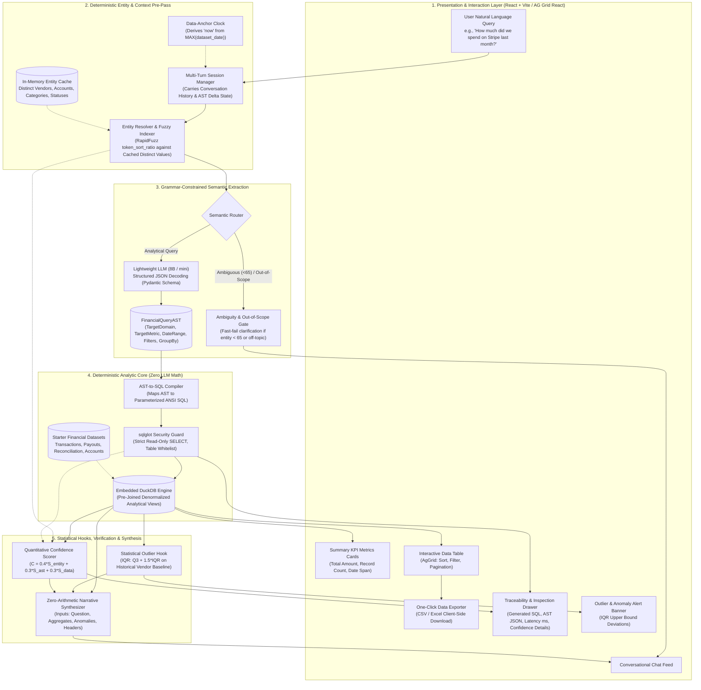
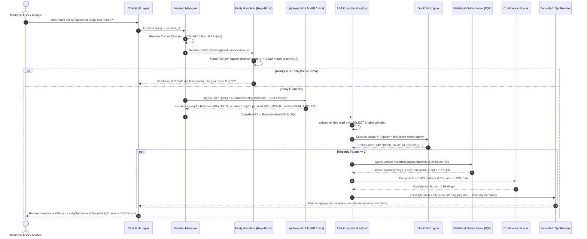

# High-Level Architecture Specification: TBX-BVP FinOps Assistant

## 1. Executive Summary

The **TBX-BVP FinOps Assistant** is an enterprise-grade conversational AI system engineered for financial operations (FinOps). It bridges the gap between non-technical business users and complex financial databases (Transactions, Vendor Payouts, Reconciliation Status, Chart of Accounts, and Vendor Master).

In financial operations, **hallucination is not a minor bug—it is an existential liability**. A single fabricated figure can corrupt audit trails, derail reconciliations, and destroy user trust.

To eliminate hallucination while adhering to the **lightweight model constraint (e.g., 8B-parameter instruction-tuned models like Llama-3.1-8B, Qwen-2.5-7B, or lightweight models like GPT-4o-mini / Gemini Flash)**, this system employs a **Hybrid Neuro-Symbolic Architecture**:
- **Neuro (Lightweight LLM)**: Restricted strictly to intent extraction, structured JSON AST generation, and zero-arithmetic narrative synthesis.
- **Symbolic (Deterministic Core)**: RapidFuzz entity grounding, date anchor derivation, AST-to-SQL compilation, AST safety validation via `sqlglot`, in-memory analytical execution via DuckDB, statistical anomaly detection via Interquartile Range (IQR), and objective mathematical confidence scoring.

---

## 2. System Architecture Diagrams

### 2.1 High-Level Component Architecture



---

### 2.2 End-to-End Sequence Diagram



---

### 2.3 Multi-Turn State Machine (AST Delta Merger)

```mermaid
stateDiagram-v2
    [*] --> Idle: User opens session
    Idle --> Turn1_Parsed: User asks "How much did we spend on AWS in Q2?"
    
    state Turn1_Parsed {
        Vendor: "AWS"
        DateRange: "Q2"
        Domain: "VENDOR_PAYOUTS"
        Metric: "SUM_AMOUNT"
        GroupBy: None
    }
    
    Turn1_Parsed --> Turn2_Delta: User asks "What about last month?"
    
    state Turn2_Delta {
        DateRange: "LAST_MONTH" (Overwritten)
        Vendor: "AWS" (Retained from Turn 1)
        Domain: "VENDOR_PAYOUTS" (Retained)
        Metric: "SUM_AMOUNT" (Retained)
    }
    
    Turn2_Delta --> Turn3_Delta: User asks "Break it down by category"
    
    state Turn3_Delta {
        GroupBy: ["CATEGORY"] (Added)
        DateRange: "LAST_MONTH" (Retained)
        Vendor: "AWS" (Retained)
    }
    
    Turn3_Delta --> Domain_Reset: User asks "Show all unreconciled bank transactions"
    
    state Domain_Reset {
        Domain: "RECONCILIATION" (Switched)
        Status: "UNRECONCILED"
        Vendor: None (Cleared on domain switch)
        DateRange: "ALL_TIME" or Inherited
    }
```

---

## 3. Core Architectural Invariants

### Invariant 1: Zero LLM Arithmetic (100% Deterministic Aggregations)
- Language models are probabilistic token predictors, fundamentally incapable of guaranteed arithmetic.
- **Rule**: The language model is strictly prohibited from summing, subtracting, calculating averages, computing percentages, or performing group-by aggregations.
- **Enforcement**: All calculations execute deterministically in DuckDB. The LLM synthesizer receives *only* the final scalar results (e.g. `total_spend: 42500.00`, `transaction_count: 14`) and is constrained to reporting these exact numbers in natural language.

### Invariant 2: Grammar-Constrained Query AST
- Generating raw ANSI SQL strings directly from 8B models (Llama-3.1-8B, Qwen-2.5-7B) results in severe syntax failure rates (e.g. invalid join conditions, hallucinated column names, improper group by clauses).
- **Rule**: The lightweight model is constrained to generate a typed Pydantic JSON AST (`FinancialQueryAST`).
- **Enforcement**: Schema enforcement via structured decoding (e.g., Pydantic V2 / Instructor / Outlines). The AST guarantees valid metrics, verified entity filters, and structured temporal bounds before any SQL is compiled.

### Invariant 3: Pre-Joined Semantic View Layer
- Dynamically joining 5 normalized relational tables (`transactions`, `vendor_payouts`, `reconciliation_status`, `chart_of_accounts`, `vendors`) on the fly introduces high failure rates.
- **Rule**: DuckDB exposes two pre-joined, denormalized semantic analytical views:
  1. `v_transactions_reconciliation` (Transactions + Accounts + Reconciliation + Vendors)
  2. `v_vendor_payouts` (Vendor Payouts + Vendor Master + Reconciliation Status)
- **Enforcement**: The AST-to-SQL compiler routes queries directly to these views based on the `target_domain` enum, eliminating dynamic join errors entirely.

### Invariant 4: Data-Anchor Temporal Awareness
- Financial test datasets frequently contain historical transaction dates (e.g., year 2024).
- **Rule**: Relative date phrases (*"last month"*, *"Q2"*, *"YTD"*) must never be evaluated against the client's current system clock.
- **Enforcement**: On database initialization, DuckDB executes:
  ```sql
  SELECT MAX(transaction_date) AS anchor_date FROM transactions;
  ```
  The Python temporal engine anchors all calendar math relative to this `anchor_date`. The LLM outputs only symbolic tokens (e.g. `LAST_MONTH`), which Python deterministically translates to exact ISO boundaries (e.g. `2024-09-01` to `2024-09-30`).

### Invariant 5: Hard Halts on Ambiguity and Missing Data
- Financial systems must never fabricate plausible records to fill an empty result.
- **Rule**: If an entity cannot be resolved with similarity $\ge 65$, or if the executed SQL returns zero records, execution halts immediately.
- **Enforcement**: A deterministic clarification or empty-state message is returned (e.g., *"No transactions found for vendor 'Stripe' in September 2024."*), completely bypassing narrative generation.

### Invariant 6: Strict Read-Only SQL Security Gate
- **Rule**: No query generated by the system may modify, mutate, or drop financial records.
- **Enforcement**: Before dispatching compiled SQL to DuckDB, the query AST is parsed using `sqlglot`. The gate verifies that:
  1. The AST is strictly `exp.Select`.
  2. No DDL/DML statements exist (`DROP`, `INSERT`, `UPDATE`, `DELETE`, `ALTER`, `ATTACH`, `COPY`).
  3. All referenced tables/views are members of the verified whitelist.

---

## 4. Mathematical Formulations

### 4.1 Quantitative Confidence Scoring Model
Rather than asking an LLM to subjectively estimate its confidence, the system computes an objective score $C \in [0.0, 1.0]$:

$$C = 0.4 \cdot S_{\text{entity}} + 0.3 \cdot S_{\text{ast}} + 0.3 \cdot S_{\text{data}}$$

Where:
- **$S_{\text{entity}}$ (Entity Grounding Ratio)**:
  $$S_{\text{entity}} = \begin{cases} 
  1.0 & \text{if exact canonical match or no entity filter requested} \\
  \frac{\text{RapidFuzz Ratio}}{100} & \text{if fuzzy score} \ge 85 \\
  0.5 & \text{if fuzzy score} \in [65, 84] \\
  0.0 & \text{if fuzzy score} < 65 \text{ (triggers clarification)}
  \end{cases}$$
- **$S_{\text{ast}}$ (Schema Alignment Score)**:
  $$S_{\text{ast}} = \begin{cases} 
  1.0 & \text{if AST validated with zero heuristics or fallback defaults} \\
  0.5 & \text{if fallback default metric or date range was inferred} \\
  0.0 & \text{if schema validation failed}
  \end{cases}$$
- **$S_{\text{data}}$ (Data Execution Status)**:
  $$S_{\text{data}} = \begin{cases} 
  1.0 & \text{if query executed successfully and returned } \ge 1 \text{ rows} \\
  0.0 & \text{if query executed successfully but returned 0 rows}
  \end{cases}$$

**Actionable Confidence Thresholds**:
- **$C \ge 0.85$ (High Confidence)**: Green UI badge. Render full narrative, KPI tiles, and data table.
- **$0.65 \le C < 0.85$ (Moderate Confidence)**: Amber UI badge. Render results accompanied by a cautionary callout (e.g., *"Vendor name was fuzzy-matched to 'Stripe Inc'."*).
- **$C < 0.65$ or $S_{\text{data}} = 0.0$ (Low / Null State)**: Short-circuit synthesis. Render an explicit empty state or clarification prompt.

---

### 4.2 Statistical Outlier & Anomaly Detection (IQR)
To provide real-time proactive intelligence without LLM overhead, the system runs an Interquartile Range ($IQR$) check on vendor payouts.

For a target vendor, historical payout distribution over the baseline period is pulled:
1. Sort historical payouts $P = [p_1, p_2, \dots, p_n]$.
2. Compute quartiles:
   - First Quartile ($Q_1$): $25^{\text{th}}$ percentile.
   - Third Quartile ($Q_3$): $75^{\text{th}}$ percentile.
   - Interquartile Range: $\text{IQR} = Q_3 - Q_1$.
3. Compute Upper Anomaly Threshold:
   $$\text{Threshold}_{\text{upper}} = Q_3 + 1.5 \cdot \text{IQR}$$
4. Anomaly Interception:
   If any retrieved transaction $p_i > \text{Threshold}_{\text{upper}}$, an anomaly record is generated:
   ```json
   {
     "anomaly_flag": true,
     "transaction_id": "TX_8821",
     "vendor_name": "Datadog",
     "amount": 28400.00,
     "upper_bound": 12500.00,
     "historical_median": 4800.00,
     "deviation_ratio": 2.27,
     "note": "Payout of $28,400.00 is 2.3x higher than historical upper threshold ($12,500.00)."
   }
   ```

---

## 5. Detailed Component Specifications

### 5.1 Presentation & Interaction Layer (`frontend/`)
- **Technology**: React + Vite with AG Grid React (`@ag-grid-community/react`) and modern dark FinOps theme.
- **Key Modules**:
  1. **Conversational Feed**: Streaming markdown display of grounded narrative answers.
  2. **KPI Summary Cards**: High-level scalar metrics (e.g., Total Spend, Unreconciled Balance, Total Records).
  3. **Interactive Data Table**: AgGrid component enabling sorting, column filtering, searching, and pagination.
  4. **One-Click CSV/Excel Exporter**: Instant download of the exact underlying tabular dataset.
  5. **Traceability Drawer**: Collapsible inspection panel showing:
     - The compiled ANSI-SQL query.
     - The generated Pydantic AST JSON.
     - Query execution latency in milliseconds.
     - Confidence score calculation breakdown ($S_{\text{entity}}, S_{\text{ast}}, S_{\text{data}}$).
  6. **Anomaly Alert Banner**: Prominently highlights flagged transactions exceeding historical thresholds.

### 5.2 Deterministic Entity Resolver (`backend/core/entity_resolver.py`)
- **Technology**: `RapidFuzz` with cached in-memory distinct lookup.
- **Workflow**:
  1. At startup, extract distinct sets from DuckDB:
     - `vendors.vendor_name`
     - `chart_of_accounts.account_name` & `chart_of_accounts.category`
     - `reconciliation_status.status`
  2. Normalize user input (lowercasing, punctuation removal).
  3. Execute `fuzz.token_sort_ratio` against candidate entity n-grams.
  4. Inject matched canonical entities directly into the LLM system prompt context.

### 5.3 Multi-Turn Session Manager (`backend/core/session_manager.py`)
- **Workflow**:
  1. Stores rolling dialogue history: `turn_id`, `user_query`, `compiled_ast`, `execution_result`.
  2. Computes the **Anchor Date** from `MAX(transaction_date)`.
  3. Executes **AST Delta Merging**:
     - Follow-up query deltas (e.g., *"What about last month?"*) update specific attributes while inheriting prior entity filters and domains.
     - Domain shift queries (e.g., switching from vendor spend to bank reconciliation) cleanly reset entity filters while preserving session continuity.

### 5.4 Semantic Router & Guardrail Gate (`backend/core/router.py`)
- Classifies user intent into one of four deterministic routes:
  1. `FINANCIAL_ANALYTIC`: Analytical questions on spend, payouts, reconciliation $\rightarrow$ AST Pipeline.
  2. `METADATA_DISCOVERY`: Schema or listing questions (e.g., *"Which vendors do we have?"*) $\rightarrow$ Fast metadata lookup.
  3. `AMBIGUOUS_CLARIFICATION`: Fuzzy match $65 \le \text{score} < 85$ $\rightarrow$ Generates clarification prompt.
  4. `OUT_OF_SCOPE`: Non-financial queries (e.g., weather, creative writing) $\rightarrow$ Polite domain boundary rejection.

### 5.5 Pydantic Semantic Query AST (`backend/models/ast.py`)
- Strongly typed schema representing analytical intent:
  - `target_domain`: Enum (`VENDOR_PAYOUTS`, `TRANSACTIONS`, `RECONCILIATION`)
  - `target_metric`: Enum (`SUM_AMOUNT`, `COUNT_RECORDS`, `AVG_AMOUNT`, `LIST_RECORDS`, `UNRECONCILED_BALANCE`)
  - `entity_filter`: List of canonical vendor or account names
  - `date_range`: Object with `relative_period` Enum (`LAST_MONTH`, `THIS_MONTH`, `Q1`, `Q2`, `Q3`, `Q4`, `YTD`, `ALL_TIME`) or explicit `start_date` / `end_date`
  - `status_filter`: Optional Enum (`RECONCILED`, `UNRECONCILED`, `PENDING`)
  - `group_by`: Optional List of Enums (`VENDOR`, `MONTH`, `CATEGORY`, `STATUS`)
  - `limit`: Integer (default 50)

### 5.6 AST-to-SQL Compiler & DuckDB Engine (`backend/engine/`)
- Programmatically translates `FinancialQueryAST` into parameterized SQL.
- Targets pre-joined semantic views:
  - `v_vendor_payouts`
  - `v_transactions_reconciliation`
- Runs two synchronized queries:
  1. **Primary KPI Query**: Calculates scalar totals (`SUM`, `COUNT`, `AVG`).
  2. **Breakdown Records Query**: Retrieves contributing individual line items for the UI table.
- Safety validation via `sqlglot` guarantees read-only execution.

### 5.7 Zero-Arithmetic Synthesizer (`backend/core/synthesizer.py`)
- Receives *only*:
  - The original user question.
  - The pre-computed scalar metrics (from DuckDB).
  - The top contributing records and column headers.
  - The anomaly report (from IQR detector).
- Constrained system prompt forbids recalculation:
  - *"State the verified findings using ONLY the numbers provided above. Do NOT perform any math or alter values."*

---

## 6. TBX Hackathon Evaluation Rubric Alignment

| Criteria | Weight | How Our Architecture Secures Maximum Score |
| :--- | :--- | :--- |
| **Accuracy & Grounding** | **30%** | **Zero LLM Arithmetic**: All calculations run in DuckDB. No dynamic join errors due to pre-joined semantic views. Hard halts on 0-row returns. |
| **Model Efficiency** | **20%** | **Constrained AST Generation**: By constraining the lightweight 8B model to emit structured JSON AST instead of raw SQL, we achieve >98% query validity with minimal token overhead (<300 prompt tokens) and latency <600ms. |
| **Natural Language Understanding** | **15%** | Pre-pass fuzzy entity grounding (RapidFuzz) + multi-turn AST delta merger seamlessly resolves complex follow-ups, date periods, and drill-downs. |
| **Functionality** | **15%** | Complete financial operations coverage (Spend, Payouts, Reconciliation). Traceability drawer, one-click CSV export, interactive AgGrid table. |
| **User Experience** | **10%** | Clean UI with KPI cards, color-coded confidence badges, anomaly alerts, sortable/filterable tables. |
| **Presentation & Impact** | **10%** | Production-ready architecture, clear separation of concerns, reproducible mock datasets, and formal model choice benchmark. |
