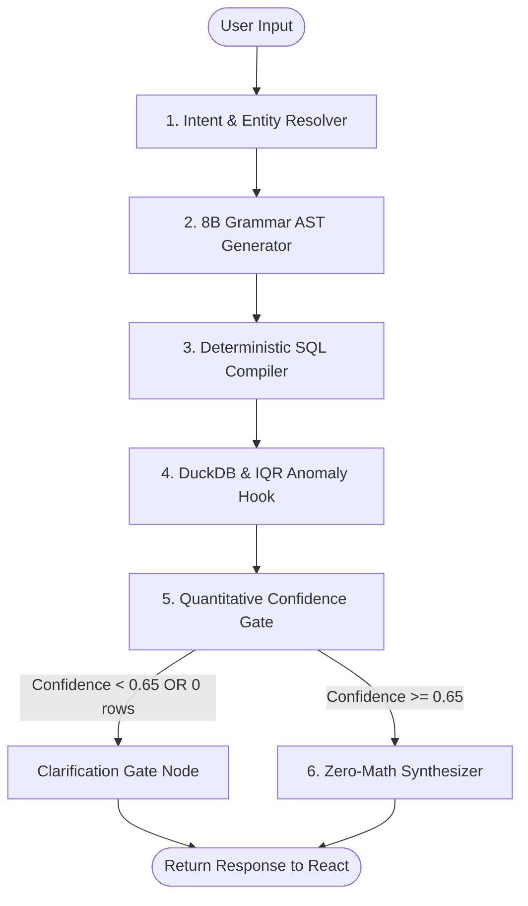

# Framework & Frontend Architecture Guide: LangGraph + React

## 1. Executive Summary & Technology Stack

| Layer | Recommended Choice | Why It Wins in This Hackathon |
| :--- | :--- | :--- |
| **Agent Orchestration** | **LangGraph** (`langgraph`) | Provides an explicit, auditable **StateGraph** with typed state, checkpointing, and conditional routing (Clarification Gate vs Execution). |
| **Backend API** | **FastAPI** (`fastapi`, `uvicorn`) | High-performance, asynchronous REST API with automatic OpenAPI docs and seamless Pydantic V2 integration. |
| **Database & OLAP** | **DuckDB** (`duckdb`) | In-memory zero-latency analytics on local CSV files; 100% of mathematical aggregations. |
| **Frontend UI** | **React + Vite** (`react`, `vite`) | Production-grade web architecture: native `ag-grid-react`, component-level reactivity, glassmorphic FinOps design, and responsive audit drawers. |

---

## 2. Why LangGraph for the Backend Agent?

LangGraph is the industry standard for stateful, multi-turn AI agents. Unlike linear chains (LangChain LCEL), LangGraph models the system as a **State Machine** with nodes and conditional edges.

### The LangGraph Agent State
```python
from typing import TypedDict, Optional, List, Dict, Any
from pydantic import BaseModel

class FinancialAgentState(TypedDict):
    session_id: str
    user_query: str
    conversation_history: List[Dict[str, str]]
    
    # Entity Resolution & Intent
    resolved_vendor: Optional[str]
    target_domain: Optional[str]            # 'vendor_payouts' | 'transactions' | 'reconciliation'
    
    # Grammar-Constrained AST
    current_ast: Optional[Dict[str, Any]]   # FinancialQueryAST as dict
    compiled_sql: Optional[str]             # Parameterized SQL string
    
    # Execution & Analytics
    db_records: Optional[List[Dict[str, Any]]]
    row_count: int
    execution_time_ms: float
    has_anomaly: bool
    anomaly_details: Optional[Dict[str, Any]]
    
    # Quality & Guardrails
    confidence_score: float                # 0.0 to 1.0
    needs_clarification: bool
    clarification_message: Optional[str]
    
    # Output
    final_narrative: Optional[str]
```

### LangGraph Workflow Diagram



### Key LangGraph Nodes:
1. **`resolve_intent_and_entities`**: Runs RapidFuzz to resolve vendor/account names and maps multi-turn delta from `conversation_history`.
2. **`generate_ast`**: Prompts the 8B model to generate the typed Pydantic `FinancialQueryAST`.
3. **`compile_sql`**: Deterministic Python compiler produces parameterized DuckDB SQL.
4. **`execute_and_detect_anomalies`**: Executes SQL on DuckDB and triggers the **IQR Anomaly Hook** ($Q_3 + 1.5 \times \text{IQR}$) on returned amounts.
5. **`evaluate_confidence`**: Computes $C = 0.4 \cdot S_{\text{entity}} + 0.3 \cdot S_{\text{ast}} + 0.3 \cdot S_{\text{data}}$.
6. **Conditional Edge**:
   - If `needs_clarification == True` $\rightarrow$ routes to `clarification_node` (halts synthesis, generates clarifying suggestions).
   - If `needs_clarification == False` $\rightarrow$ routes to `synthesizer_node` (generates narrative using DuckDB metrics only).

---

## 3. Frontend Architecture: React + Vite + AG Grid

The client layer is built using a modern **React + Vite** single-page application (SPA):

- **Component-Level Reactivity:** Fast, fluid conversational chat feed with zero page reloads.
- **Enterprise Data Grid:** Direct integration with `@ag-grid-community/react` for instant client-side sorting, column filtering, pagination, and outlier transaction highlighting.
- **Production FinOps SaaS Aesthetics:** Sleek dark mode, glassmorphic metric cards, and responsive audit inspector drawers.
- **Client-Side CSV Export:** Zero-server-overhead 1-click export of data to CSV.

---

## 4. FastAPI Backend API Contract

FastAPI exposes clean REST endpoints that your React application calls:

### Endpoint: `POST /api/chat`
#### Request Payload (from React):
```json
{
  "session_id": "c7a8b9e1-2345-4abc-8def-1234567890ab",
  "message": "Show vendor payouts for Datadogg last month"
}
```

#### Response Payload (to React):
```json
{
  "session_id": "c7a8b9e1-2345-4abc-8def-1234567890ab",
  "status": "success",
  "narrative": "In September 2024, total payouts to Datadog amounted to $12,450 across 3 disbursements. Note: Payout on 2024-09-18 ($8,200) was flagged as an outlier compared to the $2,125 baseline.",
  "confidence": {
    "score": 0.94,
    "tier": "HIGH",
    "explanation": "Matched 'Datadogg' to 'Datadog' (96% match). 3 records verified in database."
  },
  "anomaly": {
    "detected": true,
    "field": "amount",
    "outlier_value": 8200.0,
    "typical_range": "$1,800 - $2,500"
  },
  "summary_metrics": [
    {"label": "Total Spend", "value": "$12,450.00"},
    {"label": "Transactions", "value": "3"},
    {"label": "Average Payout", "value": "$4,150.00"}
  ],
  "table_data": [
    {
      "payout_id": "PAY-8012",
      "payout_date": "2024-09-05",
      "vendor_name": "Datadog",
      "amount": 2100.00,
      "status": "COMPLETED",
      "is_outlier": false
    },
    {
      "payout_id": "PAY-8099",
      "payout_date": "2024-09-18",
      "vendor_name": "Datadog",
      "amount": 8200.00,
      "status": "COMPLETED",
      "is_outlier": true
    },
    {
      "payout_id": "PAY-8140",
      "payout_date": "2024-09-28",
      "vendor_name": "Datadog",
      "amount": 2150.00,
      "status": "COMPLETED",
      "is_outlier": false
    }
  ],
  "audit_trail": {
    "sql_query": "SELECT payout_id, payout_date, vendor_name, amount, status FROM v_vendor_payouts WHERE vendor_name = 'Datadog' AND payout_date BETWEEN '2024-09-01' AND '2024-09-30' ORDER BY payout_date DESC;",
    "execution_time_ms": 3.8,
    "rows_scanned": 264,
    "model_used": "Llama-3.1-8B-Instruct (via AST)"
  }
}
```

---

## 5. React Frontend Component Tree

```
frontend/src/
├── App.jsx                        # Main layout (Header, Chat Area, Sidebar)
├── components/
│   ├── Header.jsx                 # Branding, active session ID, New Chat button
│   ├── ChatHistory.jsx            # Scrollable message list (User + Assistant)
│   ├── MessageBubble.jsx          # Plain-English narrative + Anomaly Alert Banner
│   ├── ConfidenceBadge.jsx        # Color-coded badge (🟢 94% High Confidence)
│   ├── KpiMetrics.jsx             # 3-4 key stat cards (Total Spend, Avg, Count)
│   ├── FinancialGrid.jsx          # AG Grid table with cell highlight for outliers
│   ├── CsvExportButton.jsx        # 1-Click Excel/CSV download button
│   ├── AuditDrawer.jsx            # Collapsible sheet showing SQL & execution specs
│   └── ClarificationPrompt.jsx    # Rendered when confidence is low / ambiguity found
├── services/
│   └── api.js                     # Axios / Fetch client to call FastAPI
└── styles/
    └── index.css                  # Modern dark-mode palette & glassmorphism
```

---

## 6. How the React UI Implements the Problem Statement

### 1. Verifiable Answers & AgGrid
```jsx
// components/FinancialGrid.jsx
import { AgGridReact } from 'ag-grid-react';
import 'ag-grid-community/styles/ag-grid.css';
import 'ag-grid-community/styles/ag-theme-alpine.css';

export const FinancialGrid = ({ rowData, onExportCsv }) => {
  const columnDefs = [
    { field: 'payout_id', headerName: 'ID', width: 120 },
    { field: 'payout_date', headerName: 'Date', width: 130, sortable: true },
    { field: 'vendor_name', headerName: 'Vendor', width: 160 },
    { 
      field: 'amount', 
      headerName: 'Amount ($)', 
      width: 140, 
      sortable: true,
      valueFormatter: p => `$${p.value.toLocaleString(undefined, {minimumFractionDigits: 2})}`,
      cellClassRules: {
        'anomaly-cell': params => params.data.is_outlier === true
      }
    },
    { field: 'status', headerName: 'Status', width: 130 }
  ];

  return (
    <div className="ag-theme-alpine-dark" style={{ height: 260, width: '100%' }}>
      <AgGridReact 
        rowData={rowData} 
        columnDefs={columnDefs} 
        pagination={true} 
        paginationPageSize={5} 
      />
    </div>
  );
};
```

### 2. 1-Click CSV Export Button
```jsx
// components/CsvExportButton.jsx
export const CsvExportButton = ({ data, filename = "financial_records.csv" }) => {
  const downloadCsv = () => {
    if (!data || data.length === 0) return;
    const headers = Object.keys(data[0]).join(',');
    const rows = data.map(obj => Object.values(obj).join(',')).join('\n');
    const blob = new Blob([`${headers}\n${rows}`], { type: 'text/csv' });
    const url = window.URL.createObjectURL(blob);
    const a = document.createElement('a');
    a.href = url;
    a.download = filename;
    a.click();
  };

  return (
    <button onClick={downloadCsv} className="export-btn">
      📥 Export to CSV
    </button>
  );
};
```

### 3. Audit Drawer (Explainability)
```jsx
// components/AuditDrawer.jsx
import { useState } from 'react';

export const AuditDrawer = ({ auditTrail, confidence }) => {
  const [isOpen, setIsOpen] = useState(false);

  return (
    <div className="audit-wrapper">
      <button onClick={() => setIsOpen(!isOpen)} className="audit-toggle">
        {isOpen ? '▲ Hide SQL & Audit Trace' : '▼ 🔍 View SQL & Audit Trace'}
      </button>

      {isOpen && (
        <div className="audit-content">
          <div className="audit-meta">
            <span>⚡ Execution: {auditTrail.execution_time_ms} ms</span>
            <span>📊 Scanned: {auditTrail.rows_scanned} records</span>
            <span>🤖 Engine: {auditTrail.model_used}</span>
            <span>🎯 Confidence: {(confidence.score * 100).toFixed(0)}% ({confidence.tier})</span>
          </div>
          <pre className="sql-box">
            <code>{auditTrail.sql_query}</code>
          </pre>
        </div>
      )}
    </div>
  );
};
```

---

## 7. Project Folder Structure for Fullstack Execution

```
finops/
├── backend/
│   ├── app.py                      # FastAPI application entry point
│   ├── requirements.txt            # Python dependencies (fastapi, langgraph, duckdb, etc.)
│   ├── graph/
│   │   ├── state.py                # FinancialAgentState definition
│   │   ├── nodes.py                # LangGraph nodes (Router, AST, DuckDB, Confidence, Synth)
│   │   └── workflow.py             # StateGraph builder and compiled graph
│   ├── engine/
│   │   ├── db.py                   # DuckDB connection & view initialization
│   │   └── query_compiler.py       # AST to DuckDB SQL compiler
│   └── analytics/
│       ├── anomaly.py              # IQR Anomaly Hook ($Q_3 + 1.5 * IQR)
│       └── confidence.py           # Quantitative Confidence Evaluator
├── frontend/                       # React + Vite Application
│   ├── package.json                # React, Vite, ag-grid-react, lucide-react
│   ├── vite.config.js              # Proxy configuration to http://localhost:8000
│   └── src/                        # React components as defined above
└── data/                           # Shared CSV datasets
    ├── transactions.csv
    ├── vendor_payouts.csv
    ├── reconciliation_status.csv
    ├── chart_of_accounts.csv
    └── vendors.csv
```

---

## 8. Summary Checklist for Hackathon Presentation

1. **Agent Logic**: Implemented with **LangGraph** to prove state machine rigor and zero uncontrolled loops.
2. **Frontend UI**: Built with **React + AG Grid** for a responsive, interactive financial dashboard experience.
3. **Data Integrity**: Powered by **DuckDB** for instantaneous, zero-math SQL computations.
4. **Verifiability**: 1-click CSV export, AgGrid drill-down, and the SQL Audit Drawer satisfy all hackathon grading criteria.
